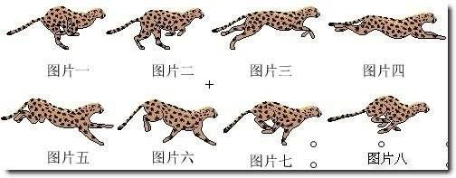

原理就是把奔跑的过程编成一幅幅图片，逐帧显示。



而oled只有128*64像素，因此需要用gimp来制作1bit格式的PBM位图。


code:main.py

```
from machine import Pin,I2C,SPI
import ssd1306
import gfx
import framebuf
from time import sleep

i2c = I2C(scl=Pin(2), sda=Pin(0), freq=100000)
oled = ssd1306.SSD1306_I2C(128,64, i2c)

#oled = ssd1306.SSD1306_I2C(128, 32, i2c, addr=0x27)
graphics = gfx.GFX(128, 64, oled.pixel)
oled.poweron()
oled.init_display()

buf={}
for i in range(1,9):
	with open("{0}.pbm".format(i), 'rb') as f:
	    f.readline() # Magic number
	    f.readline() # Creator comment
	    f.readline() # Dimensions
	    data = bytearray(f.read())
	buf[i-1] = framebuf.FrameBuffer(data, 128, 64, framebuf.MONO_HLSB)

oled.fill(0)
oled.contrast(1)
while True:
	for i in range(1,9):
		oled.blit(buf[i-1], 0, 0)
		oled.show()
```

